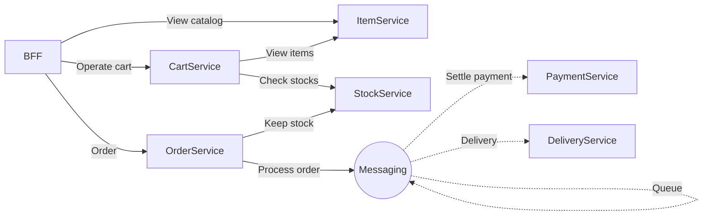
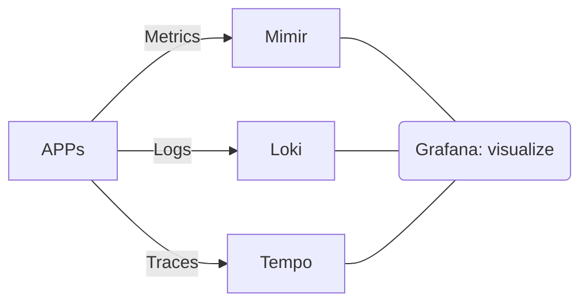

# Spring Microservice Application Example (2026)

## What's this?

- Microservice application example (sorry but headless)
- Built with Spring Boot 4.0 and Sprimg AMQP
- Runnable locally with docker-compose
- Monitored with Grafana, Loki, Tempo and Mimir

Services look like:


Monitoring infrastructure looks like:


## Run services locally

### Prerequisites

- Java >21
- Docker

### Procedure

#### 1. Start up RabbitMQ and Grafana stack.

Go to `docker` directory
```
cd docker
```

Run up RabbitMQ and Grafana stack
```
docker-compose up -d
```

#### 2. Run applications

Use IDE to start up each service.

Maven's `spring-boot:run` command is unavailable for some reasons.

#### 3. Play with applications!

- Swagger UI of BFF
  - http://localhost:9000/swagger-ui.html

1. catalog-controller: GET `/catalog`
    - You can get items and prices, images, etc.
2. cart-controller: POST `/cart`
    - You can create your cart and get `cartId`.
3. cart-controller: POST `/cart/{cartId}`
    - You can add item to your cart.
    - `itemId` should match to one of the ids in `/catalog`.
4. cart-controller: GET `/cart/{cartId}`
    - You can check items and total amount in your cart.
5. order-controller: POST `/order`
    - You can order your item virtually! Don't worry, any card payment or e-mail sending do not happen.
    - `cardExpire` must be in `MM/yy` format (month/year).
    - `cartId` must match the id obtained by POST `/cart`.

#### 4. How to use store application

Example of `/order` Post body.
```json
{
  "name": "Shin Tanimoto",
  "address": "Tokyo",
  "telephone": "0123456789",
  "mailAddress": "hello@example.com",
  "cardNumber": "0000111122223333",
  "cardExpire": "12/24",
  "cardName": "Shin Tanimoto",
  "cartId": "1"
}
```

- Grafana UI
  - http://localhost:3000


#### 5. Finish applications

1. Stop each service from your IDE

2. Stop RabbitMQ and Grafana stack

```
docker-compose down
```
