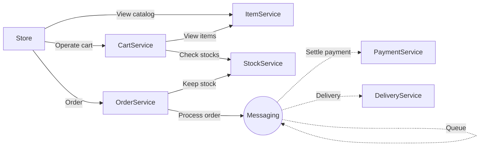
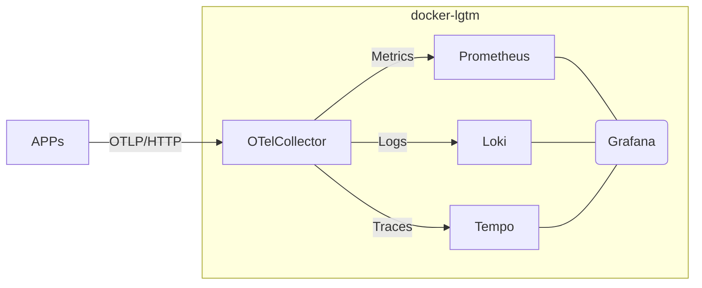

# Spring Microservice Application Example (2026)

## What's this?

- Microservice application example with webapp UI
- Built with Spring Boot 4.0 and Spring AMQP
- Instrumented with OpenTelemetry (metrics, logs, traces)
- Runnable locally with Docker Compose
- Monitored with Grafana LGTM stack

Services look like:


Monitoring infrastructure looks like:


## Run services locally

### Prerequisites

- Java 21+
- Docker
- Node.js 24.x (for webapp UI)

### Procedure

#### 1. Start up RabbitMQ and LGTM stack.

Go to `docker/dev` directory
```
cd docker/dev
```

Run up RabbitMQ and LGTM stack
```
docker compose up -d
```

#### 2. Run applications

Go to `services` directory.
```
cd services
```

Run each service with `mvnw` in separate terminals.
```
./mvnw -pl item/item-service -am spring-boot:run
./mvnw -pl stock/stock-service -am spring-boot:run
./mvnw -pl cart/cart-service -am spring-boot:run
./mvnw -pl payment/payment-service -am spring-boot:run
./mvnw -pl delivery/delivery-service -am spring-boot:run
./mvnw -pl messaging -am spring-boot:run
./mvnw -pl order/order-service -am spring-boot:run
./mvnw -pl store -am spring-boot:run
```

#### 3. Start webapp UI

Start in a separate terminal:
```
cd webapp
npm install
npm run dev
```

Open: http://localhost:5173

Default Store API URL: `http://localhost:9000`. Optional: copy `webapp/.env.example` to `webapp/.env` and set API endpoint via env var.

#### 4. Use the application

- Webapp UI: http://localhost:5173
- Swagger UI: http://localhost:9000/swagger-ui.html
- Grafana: http://localhost:3000

**API endpoints (Store service)**

1. catalog-controller: GET `/catalog`
    - You can get items and prices, images, etc.
2. cart-controller: POST `/cart`
    - You can create your cart and get `cartId`.
3. cart-controller: POST `/cart/{cartId}`
    - You can add item to your cart.
    - `itemId` should match to one of the ids in `/catalog`.
4. cart-controller: GET `/cart/{cartId}`
    - You can check items and total amount in your cart.
5. order-controller: POST `/order`
    - You can order your item virtually! Don't worry, any card payment or e-mail sending do not happen.
    - `cardExpire` must be in `MM/yy` format (month/year).
    - `cartId` must match the id obtained by POST `/cart`.

#### 5. Finish applications

1. Stop webapp (Ctrl+C)

2. Stop each service (Ctrl+C)

3. Stop RabbitMQ and LGTM stack

```
docker compose down
```

## Service ports

| Service | Port |
|---------|------|
| Store (BFF) | 9000 |
| Item Service | 9001 |
| Stock Service | 9002 |
| Cart Service | 9003 |
| Payment Service | 9004 |
| Order Service | 9005 |
| Delivery Service | 9006 |
| Messaging | 9010 |
| Webapp | 5173 |
| RabbitMQ Management | 15672 |
| Grafana | 3000 |
| OTLP Receiver | 4318 |
